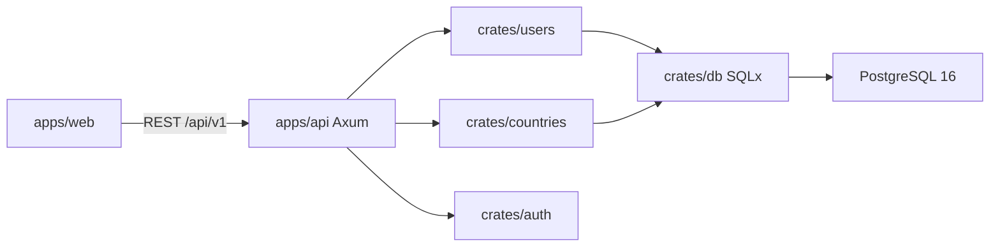

# Architecture

## Product principle

Kisaan is a **marketplace of independent farmer shops**, not a warehouse supermarket. Each farmer operates a branded shop (`Shop` aggregate). Customers may buy from many shops in one basket; fulfilment splits into per-farmer orders (Phase 3–4).

## Phase 1 shape

## Domain (foundation)

- **User** — customer / farmer / admin roles (string for now; RBAC expands later)
- **Country / Currency** — configuration-driven markets
- **Shop** — first-class row (`shops`) owned by `farmer_user_id`, keyed by `slug` + `country_code`
- **Money** — `amount_minor_units` + `currency` in `kisaan-common` (no floats)

## Database strategy

| Concern | Store |
|---------|--------|
| Users, shops, orders, ledger, inventory | **PostgreSQL** |
| Semantic search, embeddings, RAG shopping | **NebulaDB** (Phase 6) — [bwalia/nebuladb](https://github.com/bwalia/nebuladb) |

NebulaDB is excellent for hybrid SQL + vector search, but its SQL dialect and document orientation are not a substitute for ACID multi-row commerce transactions. We keep a clean adapter boundary so Phase 6 can dual-write product/shop documents for search without rewriting the ledger.

## API surface (Phase 1)

| Method | Path | Purpose |
|--------|------|---------|
| GET | `/healthz` | Liveness |
| GET | `/readyz` | Postgres readiness |
| GET | `/openapi.json` | Stub OpenAPI |
| GET | `/api/v1/countries` | Active countries |
| POST | `/api/v1/auth/register` | Register |
| POST | `/api/v1/auth/login` | Login |

Handlers stay thin; logic lives in crates.

## Legacy

`devops/helm-charts/kisaanPHPChart` and OpenResty/PHP Docker images are legacy. New deploys target `apps/*` + Postgres.
